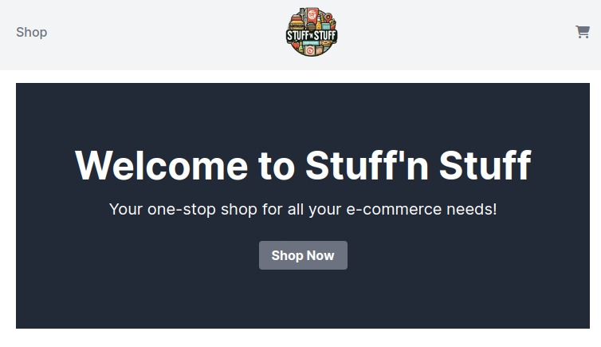

# Stuff'n Stuff

Welcome to Stuff'n Stuff, a comprehensive ecommerce platform built with Ruby on Rails 7, leveraging Hotwire for rich, interactive user experiences and Tailwind CSS for sleek, responsive design. This platform integrates Stripe for secure payments, PostgreSQL for robust data management in production, and sqlite3 for straightforward, efficient development database management.



## Key Features

- **Ecommerce Platform**: Buy and sell a wide variety of products.
- **Admin Interface**: Manage products, orders, and users seamlessly.
- **User-Friendly**: Enhanced with Hotwire for dynamic, single-page application-like behavior without writing extensive JavaScript.
- **Responsive Design**: Utilizes Tailwind CSS for a mobile-responsive, customizable interface.
- **Payment Integration**: Incorporates Stripe for secure, reliable payment processing.

## Getting Started

### Prerequisites

- Ruby on Rails 7
- Node.js (for Tailwind CSS)
- PostgreSQL (for production)
- sqlite3 (for development)

### Setting Up the Project

1. **Clone the Repository**

   ```bash
   git clone https://tiagorahal/stuff-n-stuff.git
   cd stuff-n-stuff
   ```

2. **Install Dependencies**

   ```bash
   bundle install
   ```

3. **Set Up Environment Variables**

   Configure your environment variables in the `config/credentials.yml.enc` file. Use the following command to edit this file:

   ```bash
   bin/rails credentials:edit
   ```

   Add your Stripe and database configuration as needed.

4. **Database Setup**

   - **Development**:

     Using sqlite3, the database is preconfigured. Simply run the migration:

     ```bash
     bin/rails db:migrate
     ```

   - **Production**:

     Ensure your `DATABASE_URL` environment variable is set for PostgreSQL. Then, run migrations:

     ```bash
     bin/rails db:migrate RAILS_ENV=production
     ```

### Running the Application

1. **Start the Rails Server**

   ```bash
   bin/rails server
   ```

2. Access the application at `http://localhost:3000`.

### Admin Access

To access the admin interface, navigate to `http://localhost:3000/admin`. You'll need to log in with an admin account to access these features.

## Development Notes

- **Tailwind CSS**: Tailwind is integrated for styling. Feel free to customize the design by editing the Tailwind configuration files.
- **Hotwire**: This project uses Hotwire to enrich the user interface with real-time updates and interactive features.
- **Stripe**: Payment functionalities are managed through Stripe. Ensure you have set up your Stripe keys in the credentials file.

## Contributing

We welcome contributions to Stuff'n Stuff! Please read our contributing guidelines before submitting pull requests or suggesting enhancements.

## Support

For support, please open an issue in the project repository or contact the project maintainers directly.

## License

Specify the license under which this project is available. (e.g., MIT, GPL, etc.)

---

This README provides a comprehensive guide to get started with the Stuff'n Stuff project. Feel free to customize it further to suit the specifics of your project and team's workflow.